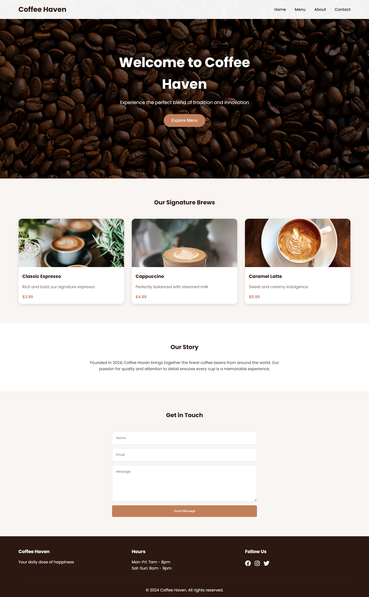

# Coffee Shop Website Projects

This repository contains two different coffee shop website implementations with different approaches and features.

## Project Overview

### 1. Coffee-website-proj2
A modern, responsive coffee shop website with elegant styling and print-friendly features.


### 2. coffee-website
An alternative implementation with additional JavaScript functionality and modular CSS structure.



## Project Structure

### Coffee-website-proj2
```
Coffee-website-proj2/
├── index.html          # Main HTML file
├── style.css           # Main stylesheet (11KB)
├── bachground.png      # Header background image (2.1MB)
├── 2(1).png            # About section image (1.8MB)
├── Espresso1.png       # Product image 1 (146KB)
├── Espresso2.png       # Product image 2 (135KB)
├── Espresso3.png       # Product image 3 (221KB)
└── 1.png               # Additional image (172KB)
```

### coffee-website
```
coffee-website/
├── index.html          # Main HTML file
├── README.md           # Project documentation
├── js/                 # JavaScript files directory
└── styles/             # CSS files directory
```

## Features Comparison

### Coffee-website-proj2
- **Responsive Design**: Adapts to all screen sizes (desktop, tablet, mobile)
- **Print-Friendly**: Optimized for printing menus and content
- **Modern UI**: Clean, elegant design with smooth transitions
- **Interactive Elements**: Hover effects and animations
- **Beautiful Typography**: Uses Playfair Display for headings

### coffee-website
- **Modular CSS**: Organized styles in separate files
- **JavaScript Functionality**: Enhanced interactivity
- **Responsive Design**: Mobile-first approach
- **Component-Based Structure**: Reusable UI components

## CSS Features

### Color Scheme (Coffee-website-proj2)
- Main Color: `#deab5f` (Golden brown)
- Primary Color: `#312e2e` (Dark gray)
- Background: `#100e0f` (Almost black)
- Text: White and various grays

### Responsive Breakpoints
- Desktop: > 1024px
- Tablet: 768px - 1024px
- Mobile: < 768px
- Small Mobile: < 480px

### Print Styles
The Coffee-website-proj2 includes special print styles that activate when printing:
- Removes unnecessary elements (nav, buttons)
- Optimizes layout for paper
- Adds print-specific elements (prices, subtitles)
- Maintains brand colors and typography
- Ensures proper page breaks

## Sections (Coffee-website-proj2)

1. **Navigation**
   - Fixed position
   - Responsive menu
   - Hover effects

2. **Header**
   - Full-screen background
   - Main heading
   - Call-to-action button

3. **Our Story**
   - Image with hover effect
   - Decorative line
   - Responsive text

4. **Coffee Section**
   - Product showcase
   - Responsive grid
   - Image hover effects

5. **Products**
   - Card-based layout
   - Price display
   - Hover animations

6. **Contact Form**
   - Clean input fields
   - Responsive layout
   - Form validation

7. **Footer**
   - Responsive grid
   - Brand colors
   - Hover effects

## Usage

### Viewing the Websites
1. Open `index.html` in a web browser for either project
2. The websites will automatically adapt to your screen size

### Printing (Coffee-website-proj2)
1. Use browser's print function (Ctrl+P or Cmd+P)
2. The print styles will automatically activate
3. The layout will optimize for paper

## Browser Support

- Chrome (latest)
- Firefox (latest)
- Safari (latest)
- Edge (latest)
- Opera (latest)

## Responsive Features

### Desktop (>1024px)
- Full layout
- Maximum image sizes
- Original font sizes

### Tablet (768px - 1024px)
- Adjusted image sizes
- Reduced font sizes
- Modified layouts

### Mobile (<768px)
- Single column layout
- Smaller images
- Stacked elements
- Adjusted spacing

### Small Mobile (<480px)
- Minimal padding
- Smallest font sizes
- Optimized for very small screens

## Print Optimization (Coffee-website-proj2)

When printing, the website:
- Removes navigation and buttons
- Adjusts colors for better printing
- Adds page breaks at logical points
- Maintains brand identity
- Optimizes images for paper
- Adds print-specific elements

## Development

### Coffee-website-proj2
This project uses a single CSS file approach with media queries for responsiveness and print styles.

### coffee-website
This project uses a modular approach with separate CSS files and JavaScript for enhanced functionality.

## Contributing

1. Fork the repository
2. Create your feature branch (`git checkout -b feature/AmazingFeature`)
3. Commit your changes (`git commit -m 'Add some AmazingFeature'`)
4. Push to the branch (`git push origin feature/AmazingFeature`)
5. Open a Pull Request

## License

This project is licensed under the MIT License - see the LICENSE file for details.

## Acknowledgments

- Google Fonts for Playfair Display
- Images from various sources
- Inspiration from coffee shop websites and design trends 